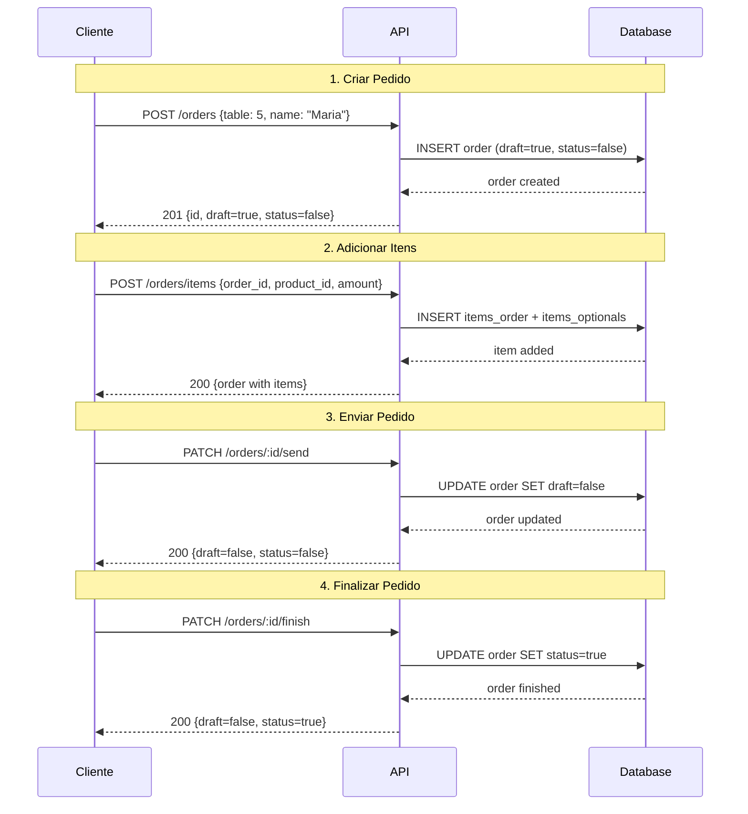

# 📡 Documentação de Endpoints - API Pastelaria

> **Versão:** 1.0  
> **Data:** 8 de março de 2026

## 📋 Índice

- [Autenticação](#autenticação)
- [Usuários](#-usuários)
- [Categorias](#-categorias)
- [Produtos](#-produtos)
- [Opcionais](#-opcionais-adicionais)
- [Pedidos](#-pedidos)
- [Códigos de Status HTTP](#-códigos-de-status-http)

---

## Autenticação

A API utiliza **JWT (JSON Web Token)** para autenticação. Após o login, inclua o token no header de todas as requisições protegidas:

```
Authorization: Bearer {seu-token-jwt}
```

### Roles de Acesso

| Role | Descrição | Permissões |
|------|-----------|------------|
| **ADMIN** | Administrador | Acesso total (gerenciar produtos, categorias, usuários) |
| **STAFF** | Funcionário | Gerenciar pedidos e visualizar catálogo |

> 💡 **Importante**: O primeiro usuário cadastrado é automaticamente ADMIN e isRoot=true.

---

## 👤 Usuários

### 1. Criar Usuário

Cria um novo usuário no sistema.

```http
POST /users
Content-Type: application/json
```

**Autenticação:** ❌ Não requerida

**Body:**
```json
{
  "name": "João Silva",
  "email": "joao@email.com",
  "password": "senha123"
}
```

**Validações:**
- `name`: mínimo 3 caracteres
- `email`: formato de email válido
- `password`: mínimo 6 caracteres

**Resposta de Sucesso (201):**
```json
{
  "id": "550e8400-e29b-41d4-a716-446655440000",
  "name": "João Silva",
  "email": "joao@email.com",
  "role": "ADMIN",
  "isRoot": true,
  "createdAt": "2026-03-08T10:00:00.000Z",
  "updatedAt": "2026-03-08T10:00:00.000Z"
}
```

**Erros Possíveis:**
- `400` - "User already exists" (email já cadastrado)
- `400` - Validation failed (dados inválidos)

---

### 2. Login (Autenticação)

Autentica um usuário e retorna um token JWT.

```http
POST /session
Content-Type: application/json
```

**Autenticação:** ❌ Não requerida

**Body:**
```json
{
  "email": "joao@email.com",
  "password": "senha123"
}
```

**Validações:**
- `email`: formato de email válido
- `password`: mínimo 6 caracteres

**Resposta de Sucesso (200):**
```json
{
  "id": "550e8400-e29b-41d4-a716-446655440000",
  "name": "João Silva",
  "email": "joao@email.com",
  "role": "ADMIN",
  "token": "eyJhbGciOiJIUzI1NiIsInR5cCI6IkpXVCJ9.eyJuYW1lIjoiSm9hbyBTaWx2YSIsImVtYWlsIjoiam9hb0BlbWFpbC5jb20iLCJyb2xlIjoiQURNSU4iLCJpYXQiOjE2NDYxNDg4MDAsImV4cCI6MTY0ODc0MDgwMCwic3ViIjoiNTUwZTg0MDAtZTI5Yi00MWQ0LWE3MTYtNDQ2NjU1NDQwMDAwIn0.signature"
}
```

**Erros Possíveis:**
- `400` - "Email or password incorrect"
- `400` - Validation failed

---

### 3. Detalhes do Usuário Logado

Retorna os dados do usuário autenticado.

```http
GET /me
Authorization: Bearer {token}
```

**Autenticação:** ✅ Requerida (qualquer usuário autenticado)

**Resposta de Sucesso (200):**
```json
{
  "id": "550e8400-e29b-41d4-a716-446655440000",
  "name": "João Silva",
  "email": "joao@email.com",
  "role": "ADMIN",
  "isRoot": true,
  "createdAt": "2026-03-08T10:00:00.000Z",
  "updatedAt": "2026-03-08T10:00:00.000Z"
}
```

**Erros Possíveis:**
- `401` - "Token missing"
- `401` - "Invalid token"
- `400` - "User not found"

---

### 4. Alterar Role de Usuário

Altera o role (permissão) de um usuário.

```http
PATCH /users/role
Authorization: Bearer {token}
Content-Type: application/json
```

**Autenticação:** ✅ Requerida (apenas ADMIN)

**Body:**
```json
{
  "email": "maria@email.com",
  "role": "ADMIN"
}
```

**Validações:**
- `email`: formato de email válido
- `role`: deve ser "ADMIN" ou "STAFF"

**Regras de Negócio:**
- ❌ Não pode alterar próprio role
- ❌ Não pode alterar role do usuário root
- ✅ Apenas ADMIN pode executar

**Resposta de Sucesso (200):**
```json
{
  "id": "660e8400-e29b-41d4-a716-446655440001",
  "name": "Maria Santos",
  "email": "maria@email.com",
  "role": "ADMIN",
  "isRoot": false,
  "createdAt": "2026-03-08T11:00:00.000Z",
  "updatedAt": "2026-03-08T12:00:00.000Z"
}
```

**Erros Possíveis:**
- `401` - "Token missing"
- `403` - "Insufficient permissions"
- `400` - "User not found"
- `400` - "You cannot change your own role"
- `400` - "Cannot change role of root user"

---

## 📂 Categorias

### 1. Criar Categoria

Cria uma nova categoria de produtos.

```http
POST /categories
Authorization: Bearer {token}
Content-Type: application/json
```

**Autenticação:** ✅ Requerida (apenas ADMIN)

**Body:**
```json
{
  "name": "Pastéis",
  "description": "Deliciosos pastéis variados"
}
```

**Validações:**
- `name`: mínimo 3 caracteres
- `description`: opcional

**Resposta de Sucesso (201):**
```json
{
  "id": "770e8400-e29b-41d4-a716-446655440002",
  "name": "Pastéis",
  "description": "Deliciosos pastéis variados",
  "createdAt": "2026-03-08T10:00:00.000Z",
  "updatedAt": "2026-03-08T10:00:00.000Z"
}
```

**Erros Possíveis:**
- `401` - "Token missing"
- `403` - "Insufficient permissions"
- `400` - Validation failed

---

### 2. Listar Categorias

Lista todas as categorias cadastradas.

```http
GET /categories
Authorization: Bearer {token}
```

**Autenticação:** ✅ Requerida (qualquer usuário autenticado)

**Resposta de Sucesso (200):**
```json
[
  {
    "id": "770e8400-e29b-41d4-a716-446655440002",
    "name": "Pastéis",
    "description": "Deliciosos pastéis variados",
    "createdAt": "2026-03-08T10:00:00.000Z",
    "updatedAt": "2026-03-08T10:00:00.000Z"
  },
  {
    "id": "880e8400-e29b-41d4-a716-446655440003",
    "name": "Bebidas",
    "description": "Sucos e refrigerantes",
    "createdAt": "2026-03-08T10:05:00.000Z",
    "updatedAt": "2026-03-08T10:05:00.000Z"
  }
]
```

**Erros Possíveis:**
- `401` - "Token missing"
- `401` - "Invalid token"

---

### 3. Detalhes de uma Categoria

Retorna os detalhes de uma categoria específica.

```http
GET /categories/:category_id
Authorization: Bearer {token}
```

**Autenticação:** ✅ Requerida (qualquer usuário autenticado)

**Parâmetros:**
- `category_id` (path): UUID da categoria

**Resposta de Sucesso (200):**
```json
{
  "id": "770e8400-e29b-41d4-a716-446655440002",
  "name": "Pastéis",
  "description": "Deliciosos pastéis variados",
  "createdAt": "2026-03-08T10:00:00.000Z",
  "updatedAt": "2026-03-08T10:00:00.000Z"
}
```

**Erros Possíveis:**
- `401` - "Token missing"
- `400` - "Category not found"

---

### 4. Atualizar Categoria

Atualiza os dados de uma categoria.

```http
PATCH /categories/:category_id
Authorization: Bearer {token}
Content-Type: application/json
```

**Autenticação:** ✅ Requerida (apenas ADMIN)

**Parâmetros:**
- `category_id` (path): UUID da categoria

**Body:**
```json
{
  "name": "Pastéis Especiais",
  "description": "Nossa linha premium de pastéis"
}
```

**Validações:**
- `name`: opcional, mínimo 3 caracteres
- `description`: opcional

**Resposta de Sucesso (200):**
```json
{
  "id": "770e8400-e29b-41d4-a716-446655440002",
  "name": "Pastéis Especiais",
  "description": "Nossa linha premium de pastéis",
  "createdAt": "2026-03-08T10:00:00.000Z",
  "updatedAt": "2026-03-08T11:00:00.000Z"
}
```

**Erros Possíveis:**
- `401` - "Token missing"
- `403` - "Insufficient permissions"
- `400` - "Category not found"

---

### 5. Remover Categoria

Remove uma categoria do sistema.

```http
DELETE /categories/:category_id
Authorization: Bearer {token}
```

**Autenticação:** ✅ Requerida (apenas ADMIN)

**Parâmetros:**
- `category_id` (path): UUID da categoria

**Regras de Negócio:**
- ❌ Não pode deletar categoria se houver pedidos com produtos dessa categoria
- ✅ Deleta produtos em cascata (se não houver pedidos)

**Resposta de Sucesso (200):**
```json
{
  "message": "Category deleted successfully"
}
```

**Erros Possíveis:**
- `401` - "Token missing"
- `403` - "Insufficient permissions"
- `400` - "Category not found"
- `400` - "Cannot delete category because there are orders with products from this category"

---

## 🍔 Produtos

### 1. Criar Produto

Cria um novo produto com imagem.

```http
POST /products
Authorization: Bearer {token}
Content-Type: multipart/form-data
```

**Autenticação:** ✅ Requerida (apenas ADMIN)

**Body (form-data):**
- `name`: string (mínimo 3 caracteres)
- `price`: string numérica (em centavos, ex: "1200" = R$ 12,00)
- `description`: string (mínimo 10 caracteres)
- `category_id`: UUID da categoria
- `file`: arquivo de imagem (JPEG, PNG, GIF - máx 5MB)

**Exemplo:**
```
name: Pastel de Carne
price: 1200
description: Delicioso pastel de carne moída com cebola e azeitonas
category_id: 770e8400-e29b-41d4-a716-446655440002
file: [arquivo-imagem.jpg]
```

**Validações:**
- Preço deve ser > 0
- Imagem é obrigatória
- Categoria deve existir
- Formatos aceitos: JPEG, PNG, GIF
- Tamanho máximo: 5MB

**Resposta de Sucesso (201):**
```json
{
  "id": "990e8400-e29b-41d4-a716-446655440004",
  "name": "Pastel de Carne",
  "price": 1200,
  "description": "Delicioso pastel de carne moída com cebola e azeitonas",
  "bannerUrl": "https://res.cloudinary.com/seu-cloud/image/upload/v1234567890/products/user-id/1234567890_pastel.jpg",
  "disabled": false,
  "category_id": "770e8400-e29b-41d4-a716-446655440002",
  "createdAt": "2026-03-08T10:00:00.000Z",
  "updatedAt": "2026-03-08T10:00:00.000Z"
}
```

**Erros Possíveis:**
- `401` - "Token missing"
- `403` - "Insufficient permissions"
- `400` - "Category does not exist"
- `400` - "Price must be greater than 0"
- `400` - "Invalid file type. Only JPEG, PNG and GIF are allowed"
- `400` - "File too large. Maximum size is 5MB"

---

### 2. Listar Produtos

Lista produtos de uma categoria com filtros.

```http
GET /products?category_id={uuid}&status={boolean}
Authorization: Bearer {token}
```

**Autenticação:** ✅ Requerida (qualquer usuário autenticado)

**Query Parameters:**
- `category_id` (obrigatório): UUID da categoria
- `status` (opcional): boolean - `true` = desabilitados, `false` = habilitados (padrão)

**Exemplo:**
```
GET /products?category_id=770e8400-e29b-41d4-a716-446655440002&status=false
```

**Resposta de Sucesso (200):**
```json
[
  {
    "id": "990e8400-e29b-41d4-a716-446655440004",
    "name": "Pastel de Carne",
    "price": 1200,
    "description": "Delicioso pastel de carne moída com cebola e azeitonas",
    "bannerUrl": "https://res.cloudinary.com/...",
    "disabled": false,
    "category_id": "770e8400-e29b-41d4-a716-446655440002",
    "productsOptionals": [
      {
        "id": "aa0e8400-e29b-41d4-a716-446655440005",
        "disabled": false,
        "optional": {
          "id": "bb0e8400-e29b-41d4-a716-446655440006",
          "name": "Queijo Extra",
          "price": 200
        }
      }
    ],
    "createdAt": "2026-03-08T10:00:00.000Z",
    "updatedAt": "2026-03-08T10:00:00.000Z"
  }
]
```

**Erros Possíveis:**
- `401` - "Token missing"
- `400` - "Category does not exist"

---

### 3. Detalhes de um Produto

Retorna os detalhes completos de um produto.

```http
GET /products/:product_id
Authorization: Bearer {token}
```

**Autenticação:** ✅ Requerida (qualquer usuário autenticado)

**Parâmetros:**
- `product_id` (path): UUID do produto

**Resposta de Sucesso (200):**
```json
{
  "id": "990e8400-e29b-41d4-a716-446655440004",
  "name": "Pastel de Carne",
  "price": 1200,
  "description": "Delicioso pastel de carne moída com cebola e azeitonas",
  "bannerUrl": "https://res.cloudinary.com/...",
  "disabled": false,
  "category_id": "770e8400-e29b-41d4-a716-446655440002",
  "category": {
    "id": "770e8400-e29b-41d4-a716-446655440002",
    "name": "Pastéis",
    "description": "Deliciosos pastéis variados"
  },
  "productsOptionals": [
    {
      "id": "aa0e8400-e29b-41d4-a716-446655440005",
      "disabled": false,
      "optional": {
        "id": "bb0e8400-e29b-41d4-a716-446655440006",
        "name": "Queijo Extra",
        "price": 200
      }
    }
  ],
  "createdAt": "2026-03-08T10:00:00.000Z",
  "updatedAt": "2026-03-08T10:00:00.000Z"
}
```

**Erros Possíveis:**
- `401` - "Token missing"
- `400` - "Product not found"

---

### 4. Atualizar Produto

Atualiza os dados de um produto (pode atualizar a imagem).

```http
PUT /products/:product_id
Authorization: Bearer {token}
Content-Type: multipart/form-data
```

**Autenticação:** ✅ Requerida (apenas ADMIN)

**Parâmetros:**
- `product_id` (path): UUID do produto

**Body (form-data, todos opcionais):**
- `name`: string
- `price`: string numérica
- `description`: string
- `file`: arquivo de imagem (nova imagem)

**Exemplo:**
```
name: Pastel de Carne Especial
price: 1500
file: [nova-imagem.jpg]
```

**Resposta de Sucesso (200):**
```json
{
  "id": "990e8400-e29b-41d4-a716-446655440004",
  "name": "Pastel de Carne Especial",
  "price": 1500,
  "description": "Delicioso pastel de carne moída com cebola e azeitonas",
  "bannerUrl": "https://res.cloudinary.com/.../nova-imagem.jpg",
  "disabled": false,
  "category_id": "770e8400-e29b-41d4-a716-446655440002",
  "createdAt": "2026-03-08T10:00:00.000Z",
  "updatedAt": "2026-03-08T11:00:00.000Z"
}
```

**Erros Possíveis:**
- `401` - "Token missing"
- `403` - "Insufficient permissions"
- `400` - "Product not found"
- `400` - "Price must be greater than 0"

---

### 5. Desabilitar Produto

Desabilita um produto e todos seus opcionais.

```http
PUT /products/disable
Authorization: Bearer {token}
Content-Type: application/json
```

**Autenticação:** ✅ Requerida (apenas ADMIN)

**Body:**
```json
{
  "product_id": "990e8400-e29b-41d4-a716-446655440004"
}
```

**Regras de Negócio:**
- ✅ Produto é marcado como `disabled: true`
- ✅ Todos os opcionais do produto são desabilitados automaticamente
- ✅ Produto não é deletado (soft delete)

**Resposta de Sucesso (200):**
```json
{
  "id": "990e8400-e29b-41d4-a716-446655440004",
  "name": "Pastel de Carne Especial",
  "price": 1500,
  "description": "Delicioso pastel de carne moída com cebola e azeitonas",
  "bannerUrl": "https://res.cloudinary.com/...",
  "disabled": true,
  "category_id": "770e8400-e29b-41d4-a716-446655440002",
  "createdAt": "2026-03-08T10:00:00.000Z",
  "updatedAt": "2026-03-08T12:00:00.000Z"
}
```

**Erros Possíveis:**
- `401` - "Token missing"
- `403` - "Insufficient permissions"
- `400` - "Product not found"

---

### 6. Adicionar Opcional ao Produto

Adiciona um opcional (adicional) a um produto.

```http
POST /products/optionals
Authorization: Bearer {token}
Content-Type: application/json
```

**Autenticação:** ✅ Requerida (apenas ADMIN)

**Body:**
```json
{
  "product_id": "990e8400-e29b-41d4-a716-446655440004",
  "optional_id": "bb0e8400-e29b-41d4-a716-446655440006"
}
```

**Validações:**
- `product_id`: UUID válido
- `optional_id`: UUID válido
- Produto e opcional devem existir
- Relação não pode estar duplicada

**Resposta de Sucesso (201):**
```json
{
  "id": "aa0e8400-e29b-41d4-a716-446655440005",
  "disabled": false,
  "product_id": "990e8400-e29b-41d4-a716-446655440004",
  "optional_id": "bb0e8400-e29b-41d4-a716-446655440006",
  "product": {
    "id": "990e8400-e29b-41d4-a716-446655440004",
    "name": "Pastel de Carne"
  },
  "optional": {
    "id": "bb0e8400-e29b-41d4-a716-446655440006",
    "name": "Queijo Extra",
    "price": 200
  },
  "createdAt": "2026-03-08T10:00:00.000Z",
  "updatedAt": "2026-03-08T10:00:00.000Z"
}
```

**Erros Possíveis:**
- `401` - "Token missing"
- `403` - "Insufficient permissions"
- `400` - "Product does not exist"
- `400` - "Optional does not exist"
- `400` - "This optional is already added to this product"

---

### 7. Remover Opcional do Produto

Remove um opcional de um produto.

```http
DELETE /products/optionals
Authorization: Bearer {token}
Content-Type: application/json
```

**Autenticação:** ✅ Requerida (apenas ADMIN)

**Body:**
```json
{
  "product_optional_id": "aa0e8400-e29b-41d4-a716-446655440005"
}
```

**Resposta de Sucesso (200):**
```json
{
  "message": "Optional removed from product successfully"
}
```

**Erros Possíveis:**
- `401` - "Token missing"
- `403` - "Insufficient permissions"
- `400` - "Product optional not found"

---

## ➕ Opcionais (Adicionais)

### 1. Criar Opcional

Cria um novo opcional que pode ser adicionado a produtos.

```http
POST /optionals
Authorization: Bearer {token}
Content-Type: application/json
```

**Autenticação:** ✅ Requerida (apenas ADMIN)

**Body:**
```json
{
  "name": "Queijo Extra",
  "price": 200
}
```

**Validações:**
- `name`: mínimo 3 caracteres, único no sistema
- `price`: string numérica > 0 (em centavos)

**Resposta de Sucesso (201):**
```json
{
  "id": "bb0e8400-e29b-41d4-a716-446655440006",
  "name": "Queijo Extra",
  "price": 200,
  "createdAt": "2026-03-08T10:00:00.000Z",
  "updatedAt": "2026-03-08T10:00:00.000Z"
}
```

**Erros Possíveis:**
- `401` - "Token missing"
- `403` - "Insufficient permissions"
- `400` - "Optional already exists"
- `400` - "Price must be greater than 0"

---

### 2. Listar Opcionais

Lista todos os opcionais cadastrados.

```http
GET /optionals
Authorization: Bearer {token}
```

**Autenticação:** ✅ Requerida (qualquer usuário autenticado)

**Resposta de Sucesso (200):**
```json
[
  {
    "id": "bb0e8400-e29b-41d4-a716-446655440006",
    "name": "Queijo Extra",
    "price": 200,
    "createdAt": "2026-03-08T10:00:00.000Z",
    "updatedAt": "2026-03-08T10:00:00.000Z"
  },
  {
    "id": "cc0e8400-e29b-41d4-a716-446655440007",
    "name": "Bacon",
    "price": 300,
    "createdAt": "2026-03-08T10:05:00.000Z",
    "updatedAt": "2026-03-08T10:05:00.000Z"
  }
]
```

**Erros Possíveis:**
- `401` - "Token missing"

---

### 3. Detalhes de um Opcional

Retorna os detalhes de um opcional específico.

```http
GET /optionals/:optional_id
Authorization: Bearer {token}
```

**Autenticação:** ✅ Requerida (qualquer usuário autenticado)

**Parâmetros:**
- `optional_id` (path): UUID do opcional

**Resposta de Sucesso (200):**
```json
{
  "id": "bb0e8400-e29b-41d4-a716-446655440006",
  "name": "Queijo Extra",
  "price": 200,
  "createdAt": "2026-03-08T10:00:00.000Z",
  "updatedAt": "2026-03-08T10:00:00.000Z"
}
```

**Erros Possíveis:**
- `401` - "Token missing"
- `400` - "Optional not found"

---

## 🛒 Pedidos

### 1. Criar Pedido

Cria um novo pedido (rascunho vazio).

```http
POST /orders
Authorization: Bearer {token}
Content-Type: application/json
```

**Autenticação:** ✅ Requerida (qualquer usuário autenticado)

**Body:**
```json
{
  "table": 5,
  "name": "Maria Silva"
}
```

**Validações:**
- `table`: número >= 1
- `name`: opcional, string

**Resposta de Sucesso (201):**
```json
{
  "id": "dd0e8400-e29b-41d4-a716-446655440008",
  "table": 5,
  "name": "Maria Silva",
  "draft": true,
  "status": false,
  "createdAt": "2026-03-08T10:00:00.000Z",
  "updatedAt": "2026-03-08T10:00:00.000Z"
}
```

**Erros Possíveis:**
- `401` - "Token missing"
- `400` - Validation failed

---

### 2. Adicionar Produto ao Pedido

Adiciona um produto ao pedido com opcionais.

```http
POST /orders/items
Authorization: Bearer {token}
Content-Type: application/json
```

**Autenticação:** ✅ Requerida (qualquer usuário autenticado)

**Body:**
```json
{
  "order_id": "dd0e8400-e29b-41d4-a716-446655440008",
  "product_id": "990e8400-e29b-41d4-a716-446655440004",
  "amount": 2,
  "product_optionals_id": [
    "aa0e8400-e29b-41d4-a716-446655440005"
  ]
}
```

**Validações:**
- `order_id`: UUID válido
- `product_id`: UUID válido
- `amount`: número >= 1
- `product_optionals_id`: array de UUIDs (opcional)

**Regras de Negócio:**
- ✅ Se já existe item com mesmo produto e mesmos opcionais, apenas incrementa quantidade
- ✅ Caso contrário, cria novo item
- ✅ Opcionais duplicados são removidos
- ✅ Opcionais são ordenados para comparação

**Resposta de Sucesso (200):**
```json
{
  "id": "dd0e8400-e29b-41d4-a716-446655440008",
  "table": 5,
  "name": "Maria Silva",
  "draft": true,
  "status": false,
  "items": [
    {
      "id": "ee0e8400-e29b-41d4-a716-446655440009",
      "amount": 2,
      "product": {
        "id": "990e8400-e29b-41d4-a716-446655440004",
        "name": "Pastel de Carne",
        "price": 1200,
        "bannerUrl": "https://res.cloudinary.com/..."
      },
      "itemsOptionals": [
        {
          "id": "ff0e8400-e29b-41d4-a716-44665544000a",
          "product_optional": {
            "optional": {
              "id": "bb0e8400-e29b-41d4-a716-446655440006",
              "name": "Queijo Extra",
              "price": 200
            }
          }
        }
      ]
    }
  ],
  "createdAt": "2026-03-08T10:00:00.000Z",
  "updatedAt": "2026-03-08T10:05:00.000Z"
}
```

**Erros Possíveis:**
- `401` - "Token missing"
- `400` - "Order not found"
- `400` - "Product not found"

---

### 3. Enviar Pedido

Envia o pedido (confirma e envia para a cozinha).

```http
PATCH /orders/:order_id/send
Authorization: Bearer {token}
```

**Autenticação:** ✅ Requerida (qualquer usuário autenticado)

**Parâmetros:**
- `order_id` (path): UUID do pedido

**Regras de Negócio:**
- ❌ Não pode enviar pedido vazio (sem itens)
- ❌ Não pode enviar pedido já enviado
- ✅ Altera `draft` de `true` para `false`

**Resposta de Sucesso (200):**
```json
{
  "id": "dd0e8400-e29b-41d4-a716-446655440008",
  "table": 5,
  "name": "Maria Silva",
  "draft": false,
  "status": false,
  "createdAt": "2026-03-08T10:00:00.000Z",
  "updatedAt": "2026-03-08T10:10:00.000Z"
}
```

**Erros Possíveis:**
- `401` - "Token missing"
- `400` - "Order not found"
- `400` - "Cannot send an empty order."
- `400` - "Order has already been sent."

---

### 4. Finalizar Pedido

Finaliza um pedido (marca como concluído/entregue).

```http
PATCH /orders/:order_id/finish
Authorization: Bearer {token}
```

**Autenticação:** ✅ Requerida (qualquer usuário autenticado)

**Parâmetros:**
- `order_id` (path): UUID do pedido

**Regras de Negócio:**
- ❌ Não pode finalizar pedido em rascunho
- ❌ Não pode finalizar pedido já finalizado
- ✅ Altera `status` de `false` para `true`

**Resposta de Sucesso (200):**
```json
{
  "id": "dd0e8400-e29b-41d4-a716-446655440008",
  "table": 5,
  "name": "Maria Silva",
  "draft": false,
  "status": true,
  "createdAt": "2026-03-08T10:00:00.000Z",
  "updatedAt": "2026-03-08T10:30:00.000Z"
}
```

**Erros Possíveis:**
- `401` - "Token missing"
- `400` - "Order not found or cannot be finished."

---

### 5. Listar Pedidos

Lista todos os pedidos do sistema.

```http
GET /orders
Authorization: Bearer {token}
```

**Autenticação:** ✅ Requerida (qualquer usuário autenticado)

**Resposta de Sucesso (200):**
```json
[
  {
    "id": "dd0e8400-e29b-41d4-a716-446655440008",
    "table": 5,
    "name": "Maria Silva",
    "draft": false,
    "status": false,
    "createdAt": "2026-03-08T10:00:00.000Z",
    "updatedAt": "2026-03-08T10:10:00.000Z"
  },
  {
    "id": "ab0e8400-e29b-41d4-a716-44665544000b",
    "table": 3,
    "name": "João Santos",
    "draft": true,
    "status": false,
    "createdAt": "2026-03-08T11:00:00.000Z",
    "updatedAt": "2026-03-08T11:00:00.000Z"
  }
]
```

**Erros Possíveis:**
- `401` - "Token missing"

---

### 6. Detalhes do Pedido

Retorna os detalhes completos de um pedido.

```http
GET /orders/details/:order_id
Authorization: Bearer {token}
```

**Autenticação:** ✅ Requerida (qualquer usuário autenticado)

**Parâmetros:**
- `order_id` (path): UUID do pedido

**Resposta de Sucesso (200):**
```json
{
  "id": "dd0e8400-e29b-41d4-a716-446655440008",
  "table": 5,
  "name": "Maria Silva",
  "draft": false,
  "status": false,
  "items": [
    {
      "id": "ee0e8400-e29b-41d4-a716-446655440009",
      "amount": 2,
      "product": {
        "id": "990e8400-e29b-41d4-a716-446655440004",
        "name": "Pastel de Carne",
        "description": "Delicioso pastel de carne moída",
        "price": 1200,
        "bannerUrl": "https://res.cloudinary.com/..."
      },
      "itemsOptionals": [
        {
          "id": "ff0e8400-e29b-41d4-a716-44665544000a",
          "product_optional": {
            "optional": {
              "id": "bb0e8400-e29b-41d4-a716-446655440006",
              "name": "Queijo Extra",
              "price": 200
            }
          }
        }
      ]
    }
  ],
  "createdAt": "2026-03-08T10:00:00.000Z",
  "updatedAt": "2026-03-08T10:10:00.000Z"
}
```

**Cálculo do Total:**
```
Item 1: (Pastel R$ 12,00 + Queijo Extra R$ 2,00) × 2 = R$ 28,00
Total do Pedido: R$ 28,00
```

**Erros Possíveis:**
- `401` - "Token missing"
- `400` - "Order not found"

---

### 7. Remover Item do Pedido

Remove um item específico do pedido.

```http
DELETE /orders/remove/:item_id?order_id={uuid}
Authorization: Bearer {token}
```

**Autenticação:** ✅ Requerida (qualquer usuário autenticado)

**Parâmetros:**
- `item_id` (path): UUID do item
- `order_id` (query): UUID do pedido

**Exemplo:**
```
DELETE /orders/remove/ee0e8400-e29b-41d4-a716-446655440009?order_id=dd0e8400-e29b-41d4-a716-446655440008
```

**Resposta de Sucesso (200):**
```json
{
  "message": "Item removed successfully"
}
```

**Erros Possíveis:**
- `401` - "Token missing"
- `400` - "Item not found"

---

### 8. Remover Pedido

Remove um pedido completo.

```http
DELETE /orders/:order_id
Authorization: Bearer {token}
```

**Autenticação:** ✅ Requerida (qualquer usuário autenticado)

**Parâmetros:**
- `order_id` (path): UUID do pedido

**Regras de Negócio:**
- ✅ Deleta todos os itens e opcionais em cascata
- ⚠️ Operação irreversível

**Resposta de Sucesso (200):**
```json
{
  "message": "Order deleted successfully"
}
```

**Erros Possíveis:**
- `401` - "Token missing"
- `400` - "Order not found"

---

## 📊 Códigos de Status HTTP

| Código | Significado | Quando Usar |
|--------|-------------|-------------|
| **200** | OK | Requisição bem-sucedida (GET, PUT, PATCH, DELETE) |
| **201** | Created | Recurso criado com sucesso (POST) |
| **400** | Bad Request | Erro de validação ou regra de negócio |
| **401** | Unauthorized | Token ausente ou inválido |
| **403** | Forbidden | Usuário sem permissão (não é ADMIN) |
| **404** | Not Found | Recurso não encontrado |
| **500** | Internal Server Error | Erro interno do servidor |

---

## 🔄 Fluxo Completo de um Pedido



---

## 📝 Notas Importantes

### Preços
Todos os preços são armazenados em **centavos** (inteiros):
- `1200` = R$ 12,00
- `599` = R$ 5,99
- `50` = R$ 0,50

### Estados do Pedido

| draft | status | Estado | Descrição |
|-------|--------|--------|-----------|
| `true` | `false` | Rascunho | Pedido em construção, pode adicionar/remover itens |
| `false` | `false` | Enviado | Pedido confirmado, em preparo |
| `false` | `true` | Finalizado | Pedido concluído/entregue |

### Tokens JWT
- **Validade:** 30 dias
- **Payload:** `{name, email, role}`
- **Subject:** `user.id`
- **Expiração:** Campo `exp` no token

### Upload de Imagens
- **Tipos aceitos:** JPEG, PNG, GIF
- **Tamanho máximo:** 5MB
- **Armazenamento:** Cloudinary
- **Pasta:** `products/{user_id}/`
- **Nome:** `{timestamp}_{originalname}`

---

**Documentação gerada em:** 8 de março de 2026  
**Versão da API:** 1.0

Para mais informações técnicas, consulte:
- [README.md](./README.md) - Guia de instalação e início rápido
- [CONTEXTO_TECNICO.md](./CONTEXTO_TECNICO.md) - Documentação técnica completa
